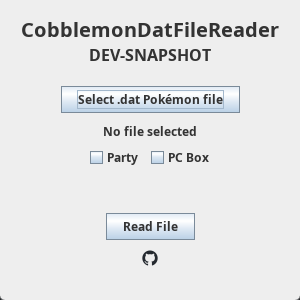
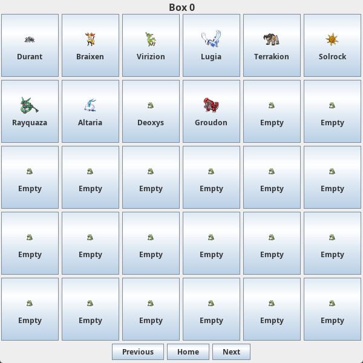

# CobblemonDatFileReader
CobblemonDatFileReader is a standalone graphical utility that reads Cobblemon .dat files.

## Description
CobblemonDatFileReader is a standalone graphical utility that reads ".dat" playerdata files from Cobblemon. This utility allows you to browse the files in an interface which attempts to replace in game Party/PC layouts.

### Features
- Upon hovering on a Pokémon slot, it will display useful characteristics/stats data.
- Upon clicking on a Pokémon slot, it will copy the `/pokegive <specs>` format. This can be useful when attempting to manually retrieve Pokémon from a player's files. (e.g. from a backup/snapshot)

### How to use CobblemonDatFileReader ?
- **Requirements: Java 21.**
- Double-click on **CobblemonDatFileReader-VERSION.jar** or run **java -jar CobblemonDatFileReader-VERSION.jar**.
- Select your **####-####-####-####.dat** file.
- Select **Party** or **PC Box**.
*(Note: if the parent folder is **playerpartystore** or **pcstore**, it will attempt to pre-select the box.)*
- Select **Read File**.
- Browse freely!

### How to uninstall CobblemonDatFileReader ?
- Simply delete the **CobblemonDatFileReader-VERSION.jar** file!
  *(Note: no data, such as configurations, etc., is stored locally!)*

#### Dependencies
- [Querz NBT](https://github.com/Querz/NBT) - Querz NBT is used to read the NBT data from the ".dat" files.
  *(Note: No data is ever written.)*
- [PokeAPI](https://github.com/PokeAPI/pokeapi) - PokeAPI is used to query for the Poké Dex IDs as well as their sprites which are bundled!
- [Log4j2](https://github.com/apache/logging-log4j2), [Log4j-Slf4j Bridge](https://github.com/apache/logging-slf4j), [Slf4j](https://www.slf4j.org/) - Apache Log4j, as well as the Slf4j API is used for all Logging purposes.
- [Jackson](https://github.com/FasterXML/jackson) - FasterXML Jackson is used for Json mapping the PokeAPI Poké Dex ID queries.